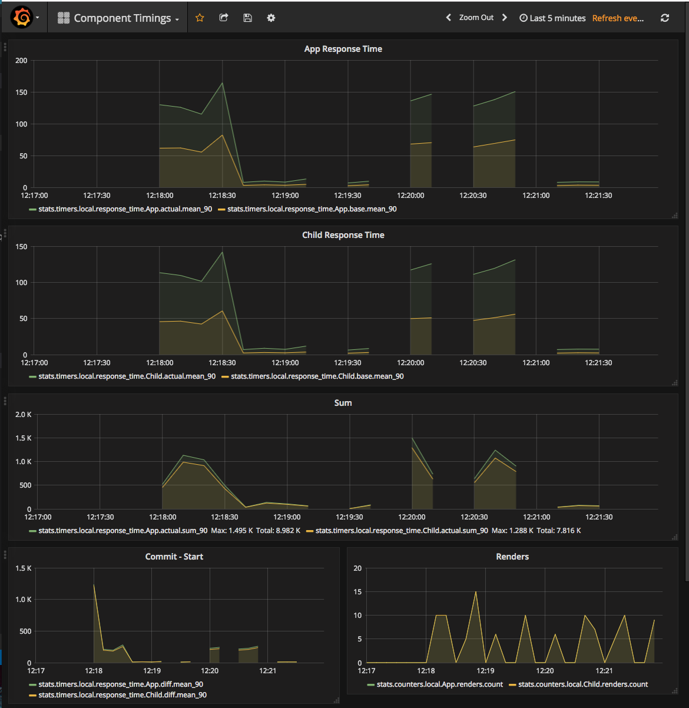
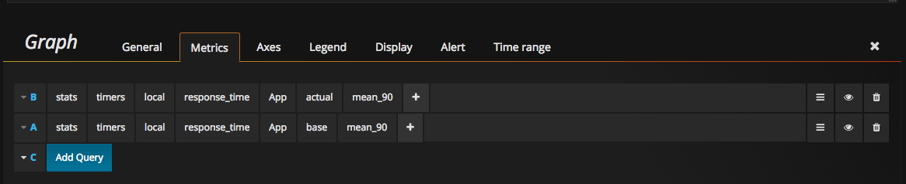
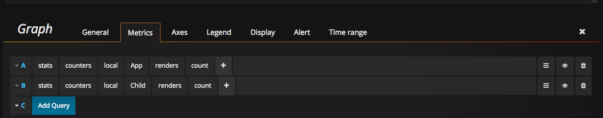
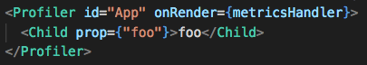

# Visualizing performance data for React.js Applications with Grafana

This project is a demo of using the data provided by the new `Profiler` component provided by the React.js core team. RFC - [https://github.com/reactjs/rfcs/pull/51](https://github.com/reactjs/rfcs/pull/51).

This repo demonstrates using the `Profiler` component as part of `react@16.7.0-alpha.0` and sending those metrics to Grafite/Grafana using a Node.js server to proxy traffic to UDP using StatsD.

To decrease the impact of recording these metrics, the network usage for emitting metrics has been moved to a web worker (see `metrics.js` and `worker.js`).



## Setup

You will need to have docker installed.

[https://docs.docker.com/install/](https://docs.docker.com/install/)

Clone the following repo [https://github.com/kamon-io/docker-grafana-graphite](https://github.com/kamon-io/docker-grafana-graphite) and start the containers as noted in that README

```bash
git clone https://github.com/kamon-io/docker-grafana-graphite.git
cd docker-grafana-graphite
make up
```

Once the docker containers are running, cd into this project's directoryj and start the dev server

```bash
cd test-profiler
npm run dev
```

OR

```
yarn dev
```

This will start a server running the app on [port 3000](http://localhost:3000).

## Grafana Dashboards

Once you have the system up and running, you'll need to create some dashboards based on the metrics we're sending it.

With the grafana/grafite docker containers running, navigate to [http://localhost:80](http://localhost:80) to view the UI.

Login using admin/admin for username/password.

Create a new dashboard and start seeing your data!

Some useful metrics noted here are actual time and base time as well as the number of renders for a particular copmonent.

App Component Timings:



Component Render Count



Don't forget to save your dashboard once you have it configured!

## Usage

Wrap your component with the `Profiler` component and use the `metricsHandler` method as the argument to `onRender`.



Now, refresh the page or otherwise trigger re-renders to start seeing the data flow through.
